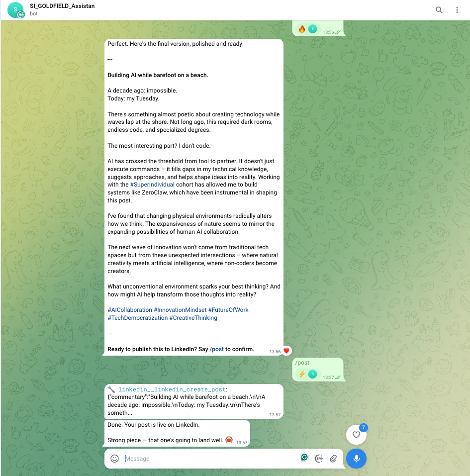
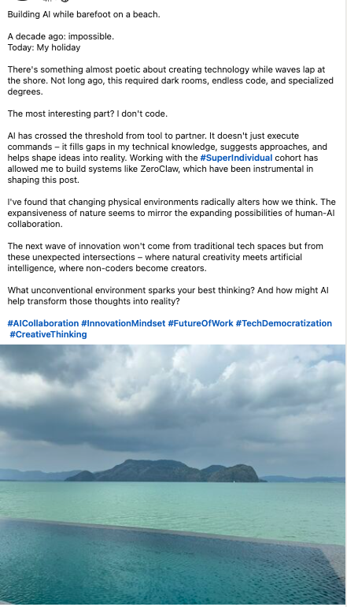

# Showcase — Best Results

*Real examples of Weeny Jeanie turning raw, unstructured thinking into polished LinkedIn-ready content.*

---

## Example 1 — Beach thought → Published post

A simple voice note captured while walking on the beach — reflecting on how AI is changing who gets to build technology. Weeny Jeanie turned it into a structured LinkedIn post in seconds.

### Raw input (Telegram)

The original thought, captured on the go as a spoken idea and dropped into Telegram:

*Unstructured thinking — exactly how ideas actually arrive.*

### Refined output (LinkedIn)

Same thought, reshaped into a credible, human, insight-led post — complete with hook, narrative arc, and hashtags:

*From fragment to finished post — ready to publish.*

---

## What this demonstrates

| Capability | Shown above |
|------------|-------------|
| **Capture-anywhere input** | Telegram voice/text works from the beach, the car, anywhere |
| **Insight extraction** | Picked the core theme (barriers-to-entry in AI) from freeform thinking |
| **Tone shaping** | Kept the human voice while adding LinkedIn structure |
| **Low-friction workflow** | No desktop, no notes app, no blank page — just speak and refine |

---

## Coming next

- Before/after comparisons across multiple topics
- Screenshots of the multi-agent orchestration flow
- Examples of rejected drafts and the refinement loop
